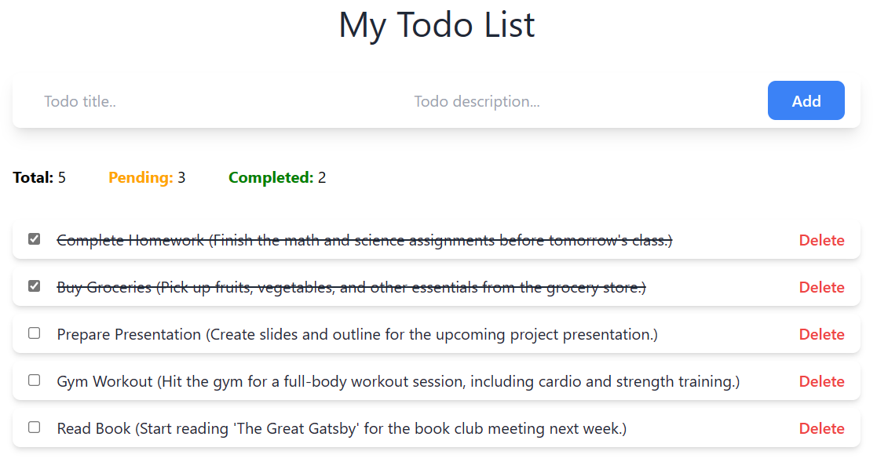

# Todo App with NestJS and Angular



## Table of Contents

- [Overview](#overview)
- [Features](#features)
- [Prerequisites](#prerequisites)
- [Getting Started](#getting-started)
  - [Docker Compose](#docker-compose)
  - [Local Setup](#local-setup)
- [API Documentation](#api-documentation)


## Overview

This project is a simple Todo app built using NestJS for the backend, Angular for the frontend, and Docker Compose for container orchestration. The application uses PostgreSQL as its database, with a volume attached to ensure data persistence.

Real-time updates for Todo items are achieved through the integration of WebSockets.

## Features

- **Todo CRUD Operations:**
- **Real-time Updates:** Utilizes WebSockets for instant updates on Todo changes.
- **Dockerized:** Easy deployment and scalability using Docker Compose.

## Prerequisites

Before you begin, ensure you have the following installed:

- [Docker](https://www.docker.com/get-started)
- [Node.js](https://nodejs.org/) (for local setup without Docker)

## Getting Started

### Docker Compose

1. Clone the repository:

2. Build and run the containers:

   ```bash
   docker-compose up --build
   ```

3. Access the application at [http://localhost:4200](http://localhost:4200).

### Local Setup

If you prefer running the application locally without Docker:

1. Ensure PostgreSQL is installed and running.

2. Create a `.env` file inside the backend folder. The env file should have the following structure:
    ```env
    DB_HOST=<YOUR_DB_HOST>
    DB_USERNAME=<YOUR_DB_USERNAME>
    DB_PORT=<YOUR_DB_PORT>
    DB_PASSWORD=<YOUR_DB_PASSWORD>
    DB_NAME=<YOUR_DB_NAME>
    ```

3. Install dependencies and start the backend:

   ```bash
   cd backend
   npm install
   npm run start
   ```

4. Install dependencies and start the frontend:

   ```bash
   cd frontend
   npm install
   npm run start
   ```

5. Access the application at [http://localhost:4200](http://localhost:4200).

### API Documentation
The API is documented using Swagger. Access the Swagger UI at http://localhost:3000/api for detailed information about the API endpoints.
